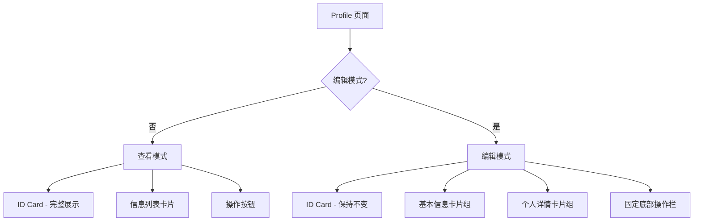
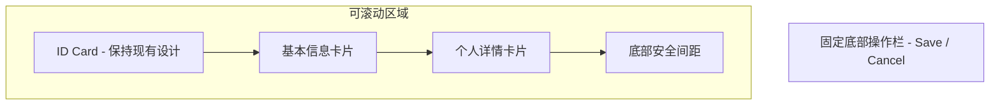
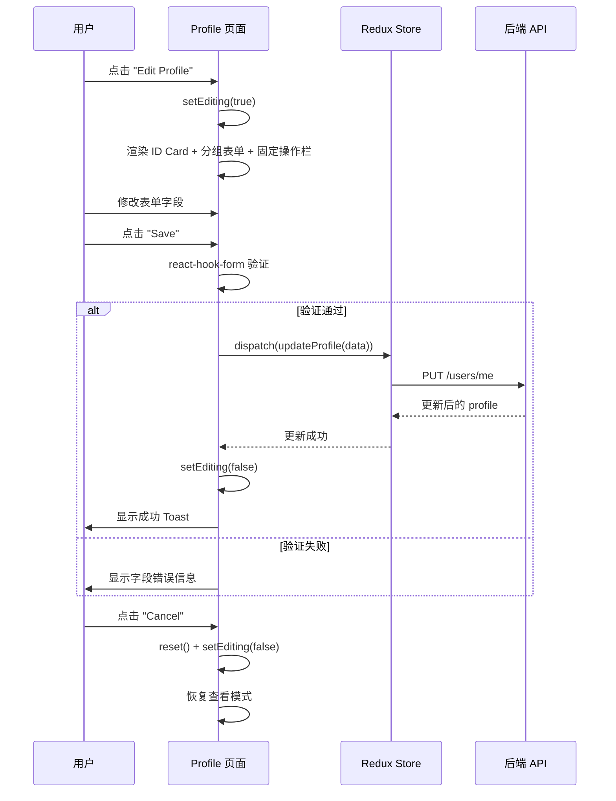

# 设计文档：Profile 编辑页面移动端重新设计

## 概述

当前 Profile 编辑页面在移动端存在多个体验问题：表单字段间距过大导致过度滚动、并排布局在小屏幕上拥挤、保存/取消按钮未固定在底部、缺少逻辑分组。本次重新设计将采用移动端优先的方式，通过卡片化分组、紧凑间距、固定底部操作栏等方式，显著提升 375px 及以上屏幕的编辑体验。

技术栈保持不变：React + Radix UI + SASS Modules + Redux Toolkit。不引入新依赖，仅重构 `Profile.tsx` 和 `Profile.module.scss`。

## 架构

整体页面结构从"平铺表单"重构为"分组卡片 + 固定底部操作栏"模式。顶部 ID Card 区域保持不变。



### 编辑模式页面结构



## 组件和接口

### 组件 1：表单分组卡片 - FormSection

**用途**：将表单字段按逻辑分组，用卡片容器包裹，提供视觉层级。

**分组方案**：
- 卡片 1 - 基本信息：displayName、bio
- 卡片 2 - 个人详情：gender、birthday、location、occupation、company

**结构**：
```
.formSection
  ├── .sectionTitle (分组标题)
  └── .sectionBody (字段容器)
      ├── .field (单个字段)
      └── .field (单个字段)
```

**职责**：
- 提供视觉分组，减少认知负担
- 卡片化设计增加层次感
- 内部字段使用紧凑间距

### 组件 2：固定底部操作栏 - StickyFormActions

**用途**：Save 和 Cancel 按钮固定在屏幕底部，用户无需滚动即可操作。

**结构**：
```
.stickyActions
  ├── Save Button
  └── Cancel Button
```

**职责**：
- 固定在视口底部，位于 BottomNav 上方
- 提供毛玻璃背景效果，与内容区分
- 按钮水平排列，Save 在左（主操作），Cancel 在右

## 数据模型

数据模型无变化，继续使用现有 `UserProfile` 接口和 `profileSlice`：

```typescript
interface UserProfile {
  id: string
  email: string
  displayName: string
  avatarUrl: string
  bio: string
  gender: string
  birthday: string
  location: string
  occupation: string
  company: string
}
```

**表单验证规则**（保持不变）：
- displayName：必填
- bio：最大 200 字符
- 其他字段：可选

## 详细设计

### 1. 编辑模式布局变更

#### 1.1 ID Card 区域（保持不变）

编辑模式下，顶部 ID Card 保持现有设计不变，包括完整头像、用户名、性别 Badge、bio、职业信息和邮箱行。

#### 1.2 表单分组卡片

所有字段改为单列布局（移动端），取消 Gender/Birthday 和 Occupation/Company 的并排：

```
┌─ 基本信息 ──────────────────┐
│  Display Name               │
│  [________________]         │
│                             │
│  Bio                        │
│  [________________]         │
│  [________________]         │
└─────────────────────────────┘

┌─ 个人详情 ──────────────────┐
│  Gender                     │
│  [Select ▼]                 │
│                             │
│  Birthday                   │
│  [DatePicker 📅]            │
│                             │
│  Location                   │
│  [________________]         │
│                             │
│  Occupation                 │
│  [________________]         │
│                             │
│  Company                    │
│  [________________]         │
└─────────────────────────────┘
```

- 卡片使用 `$radius-md` 圆角 + `$shadow-sm` 阴影
- 卡片内部 padding: `$spacing-md`
- 字段间距: `$spacing-md` (16px)，比当前 `$spacing-sm` (8px) 更合理
- 分组标题: 12px, 500 weight, `$color-text-muted`

#### 1.3 固定底部操作栏

```
━━━━━━━━━━━━━━━━━━━━━━━━━━━━━
  [ Save ]    [ Cancel ]
━━━━━━━━━━━━━━━━━━━━━━━━━━━━━
```

- `position: fixed; bottom: 0; left: 0; right: 0`
- 背景: 半透明白色 + `backdrop-filter: blur(12px)`
- 上边框: 1px solid `$color-border`
- 内部 padding: `$spacing-sm $spacing-md`
- padding-bottom 需要加上 `env(safe-area-inset-bottom)`
- 按钮水平排列，flex gap: `$spacing-sm`
- 两个按钮等宽，max-width: 300px（容器 max-width）
- 页面内容区需要额外 bottom padding 避免被遮挡

#### 1.4 响应式断点处理

**移动端 (< 640px)**：
- 所有字段单列布局
- 固定底部操作栏

**平板及以上 (≥ 640px)**：
- Gender + Birthday 可恢复并排
- Occupation + Company 可恢复并排
- 操作栏可改为非固定，跟随表单底部

### 2. 查看模式（保持不变）

查看模式的 ID Card、信息列表、操作按钮保持现有设计不变。

### 3. 交互流程



## 错误处理

### 场景 1：表单验证失败

**条件**：displayName 为空或 bio 超过 200 字符
**响应**：在对应字段下方显示红色错误提示（保持现有行为）
**恢复**：用户修正后错误自动消失

### 场景 2：API 更新失败

**条件**：网络错误或服务端返回错误
**响应**：显示错误 Toast，保持编辑模式不退出
**恢复**：用户可重新点击 Save 重试

### 场景 3：编辑中误触 Cancel

**条件**：用户在编辑中点击 Cancel
**响应**：表单 reset 到原始值，退出编辑模式
**恢复**：用户可重新点击 Edit Profile 进入编辑

## 测试策略

### 单元测试

- 验证编辑模式下 ID Card 保持完整展示
- 验证表单分组卡片正确渲染两个分组
- 验证固定底部操作栏包含 Save 和 Cancel 按钮
- 验证表单验证规则（displayName 必填、bio 长度限制）

### 视觉/布局测试

- 375px 宽度下所有字段单列显示
- 640px+ 宽度下 Gender/Birthday 和 Occupation/Company 恢复并排
- 固定操作栏不遮挡表单内容
- 固定操作栏在 BottomNav 隐藏时（平板+）正确定位

### 交互测试

- 点击 Edit → 进入编辑模式 → 表单预填充当前值
- 修改字段 → Save → API 调用 → 退出编辑模式
- Cancel → 表单重置 → 退出编辑模式
- 性别切换后主题色正确跟随

## 性能考虑

- 固定底部操作栏使用 `backdrop-filter: blur()` 可能在低端设备上有性能影响，可降级为纯色背景
- 编辑模式切换使用条件渲染，不引入额外的路由或懒加载
- 表单状态管理继续使用 react-hook-form，无额外性能开销

## 安全考虑

- 无新增安全风险，继续使用现有的 API 认证机制
- 表单提交数据通过 Redux Thunk 发送，保持现有的错误处理

## 依赖

- 无新增依赖
- 现有依赖：React, Radix UI, react-hook-form, Redux Toolkit, SASS Modules, react-day-picker, react-mobile-picker


## Correctness Properties

*A property is a characteristic or behavior that should hold true across all valid executions of a system-essentially, a formal statement about what the system should do. Properties serve as the bridge between human-readable specifications and machine-verifiable correctness guarantees.*

### Property 1: 表单预填充与 Profile 数据一致性

*For any* valid UserProfile 对象，当进入编辑模式时，表单中每个字段的值都应与对应的 profile 属性值完全一致（displayName、bio、gender、birthday、location、occupation、company）。

**Validates: Requirement 10.2**

### Property 2: Cancel 重置表单到原始值

*For any* valid UserProfile 数据和任意表单修改操作，点击 Cancel 后，所有表单字段的值都应恢复为进入编辑模式时的原始 profile 数据。

**Validates: Requirement 9.1**

### Property 3: 有效表单数据正确提交

*For any* 通过验证的表单数据（displayName 非空且 bio 不超过 200 字符），点击 Save 后，dispatch 的 updateProfile action 应携带与表单字段完全一致的数据。

**Validates: Requirement 8.1**

### Property 4: Bio 超长字符串触发验证错误

*For any* 长度超过 200 个字符的字符串作为 bio 输入，提交表单时应触发验证错误，阻止表单提交。

**Validates: Requirement 7.2**

### Property 5: 按钮不硬编码 color 属性

*For any* Profile_Page 中渲染的 Radix Button 组件，其 color prop 都不应被显式设置，应由主题 accentColor 自动控制。

**Validates: Requirement 6.2**
